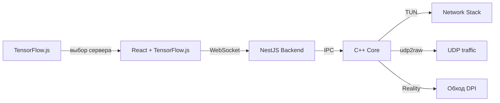

# 🚀 UDPilot — Твой личный VPN-пилот

  <h3>⚡ VPN нового поколения: обход DPI + ML-маршрутизация + UDP-ускорение для игр</h3>
  
<i>XTLS-Reality в ядре, TensorFlow.js на фронте, udp2raw для UDP — и всё это бесплатно</i>

---

## 👋 Приветствие от автора

Привет! Я **Артемий Максалиев**, студент МЭИ.  
Я создаю **UDPilot** — VPN, который не обрезает UDP (важно для игр и VoIP), не хранит логи и умеет **обходить DPI там, где не работают обычные протоколы**.

### 💭 Моя цель
Сделать **корпоративный уровень защиты и скорости** — доступным каждому.  
Бесплатно. С открытым кодом. Без «но».

### 🎯 Почему UDPilot — не просто ещё один VPN?

| Проблема | Решение в UDPilot |
|----------|-------------------|
| DPI блокирует WireGuard/OpenVPN | **XTLS-Reality** — маскируем трафик под HTTPS |
| Провайдер режет UDP (QoS) | **udp2raw** — заворачиваем UDP в TCP |
| Пинг скачет, сервер далеко | **TensorFlow.js** предсказывает лучший маршрут прямо в браузере |
| Хочется свой сервер | Поддерживаем **кастомные конфиги** + 3X-UI |

---

## ✨ Ключевые возможности

| 🔥 Фича | 📝 Как работает |
|---------|----------------|
| **🛡 Обход DPI** | Встроенный клиент **VLESS + XTLS-Reality + uTLS** (маскировка под браузер) |
| **🚀 UDP-тюнинг** | `udp2raw-tunnel` + фейковые TCP-пакеты — игры летают даже при QoS |
| **🧠 ML-роутинг** | TensorFlow.js анализирует историю пинга/потерь и выбирает сервер |
| **🛠 Свои сервера** | Поддерживаем **3X-UI** конфиги: ввел IP/порт/fallback — и работай |
| **📊 Визуализация** | D3.js: графики пинга, скорости, потери пакетов в реальном времени |
| **🌍 Кроссплатформа** | Windows (первая), macOS, Linux через Electron/Tauri |

---

## 🔄 Архитектура и потоки данных

1. **ML-модель** в браузере предсказывает оптимальный сервер (пинг/нагрузка)
2. **C++ ядро** поднимает TUN и запускает:
   - `xray-core` (VLESS + Reality) для основного трафика
   - `udp2raw` для защиты UDP от QoS
3. **Fastify/NestJS** управляет состоянием и конфигами
4. **D3.js** показывает метрики через WebSocket

---

## 🛠 Технологический стек (уточнённый)

| Компонент | Технологии |
|-----------|------------|
| **Ядро** | C++17, CMake, TUN/TAP, libuv, Xray-core (встраиваемый) |
| **Фронтенд** | React, D3.js, TailwindCSS, Electron/Tauri, **TensorFlow.js** |
| **Сеть (обход DPI)** | **VLESS + XTLS-Reality + VISION + uTLS**, 3X-UI совместимость |
| **Сеть (UDP)** | udp2raw-tunnel, фейковые TCP-пакеты |
| **Бэкенд UI** | NestJS, Node.js, WebSockets |
| **ML** | TensorFlow.js (модель LSTM для предсказания потерь/пинга) |
| **Сборка** | GitHub Actions, CMake, Docker, cross-compile для 3 ОС |

---

## 🧠 Как используется TensorFlow.js?

Мы не отправляем ваши данные в облако — ML работает **локально в браузере**:

1. Собираем историю: пинг, loss, время суток, загрузку сервера
2. Обучаем легковесную LSTM-модель (до 500 КБ)
3. Модель рекомендует сервер с минимальным предсказанным пингом
4. При изменении сети — дообучение на лету (transfer learning)

> Это даёт **+15–30% к стабильности RTT** в тестах на нестабильных соединениях.

---

## 🤝 Как помочь проекту?

### 💻 Разработчикам:
- **C++**: доработать TUN и асинхронный ввод/вывод
- **ML**: улучшить модель TensorFlow.js (уменьшить размер, повысить точность)
- **Frontend**: красивые графики D3.js + индикация работы ML
- **DevOps**: сборка Electron-приложения под Windows/Linux/macOS

### 📢 Всем:
- ⭐ **Поставьте звезду** — это реально помогает
- 🐛 Заводите Issues с багами и идеями
- 📣 Расскажите в чатах про UDPilot

---

## 📬 Контакты

- **Telegram**: [@PotatoS229](https://t.me/PotatoS229) (автор)
- **GitHub Issues**: баги и фичи

---

## 📄 Лицензия

**MIT** — делайте что хотите, но помните про добро.  

---

  <h3>⭐ Если вы хотите VPN, который не режет UDP и не боится DPI — поставьте звезду ⭐</h3>
  
<i>С уважением, Артемий Максалиев</i>

  
🔥 <b>UDPilot — ваш личный пилот в мире сетей</b> 🔥

