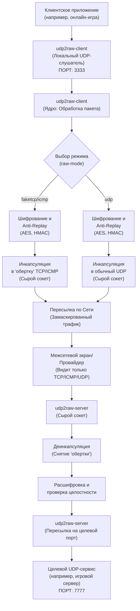
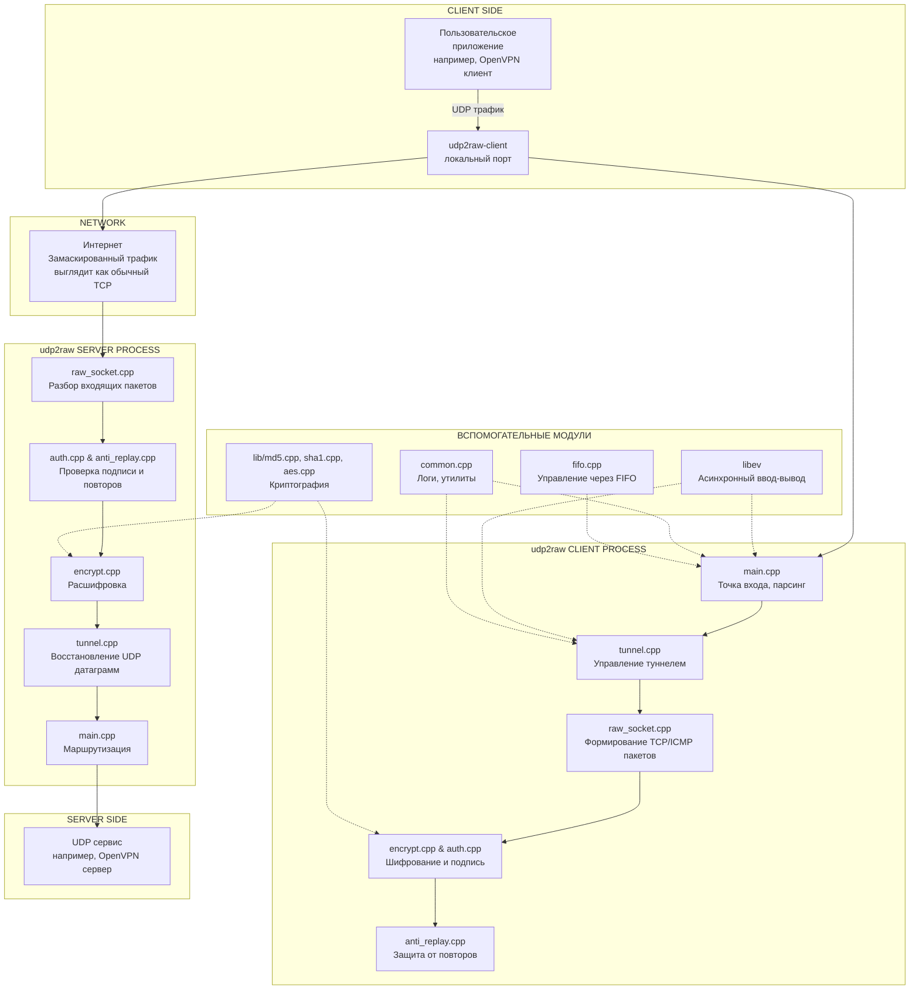

Всем обзий привет, хотел бы поблагодорить проект Udp2raw-tunnel, так как я при разработки данного проекта, взял их проект как пример, и хочу выразить свою благодарность людям, кто разработал Udp2raw-tunnel, ребят вы лучше

В крации, что я понял про проект Udp2raw-tunnel
1) Маскирует трафик: Превращает UDP-пакеты в "фейковые" TCP- или ICMP-пакеты. Для интернет-провайдера или сетевого экрана ваш трафик выглядит как обычное веб-соединение или ping, а не как UDP .

2) Шифрует и защищает: Все данные шифруются, и есть защита от атак повторного воспроизведения (replay attack), что повышает безопасность .

3) Восстанавливает соединение: Если связь оборвалась (например, вы переключились с Wi-Fi на мобильный интернет), udp2raw автоматически переподключится, и ваши программы (например, онлайн-игра или VPN) этого даже не заметят .

4) Не является ускорителем: Важный нюанс: сам по себе udp2raw не ускоряет интернет. Его задача — сделать так, чтобы трафик вообще доходил до цели в обход блокировок. Для ускорения его часто используют в паре с другими программами .

Где это может пригодиться? Например, если ваш провайдер намеренно замедляет UDP-трафик (что важно для игр или VoIP-звонков) или если вы хотите использовать VPN поверх UDP в сети, где разрешен только TCP, udp2raw может решить эту проблему

Я попытаюсь быть максимально точным и вот примерная схема проекта  Udp2raw-tunnel
```bash
udp2raw-tunnel/
│
├── .git/                   # Служебная директория системы контроля версий Git
├── .github/                # Файлы для интеграции с GitHub (например, шаблоны для issue)
│
├── src/                    # ИСХОДНЫЙ КОД ПРОЕКТА (ядро)
│   ├── main.cpp            # Главный файл. Точка входа, парсинг аргументов командной строки,
│   │                       # инициализация режима (клиент/сервер), главный цикл событий.
│   ├── tunnel.cpp          # Реализация основной логики туннеля. Здесь происходит связывание
│   │                       # входящего UDP-потока с исходящим raw-сокетом, управление
│   │                       # соединениями, мультиплексирование.
│   ├── raw_socket.cpp      # Работа с сырыми сокетами. Содержит код для создания пакетов
│   │                       # с "фейковыми" TCP/ICMP/UDP заголовками, их отправки и приема.
│   ├── encrypt.cpp         # Модуль шифрования. Реализует AES-128-CBC, XOR и другие
│   │                       # методы, указанные в `--cipher-mode`.
│   ├── auth.cpp            # Модуль аутентификации. Реализует HMAC-SHA1, MD5, CRC32 для
│   │                       # проверки целостности и аутентичности пакетов (`--auth-mode`).
│   ├── anti_replay.cpp     # Реализация механизма защиты от повторных атак (anti-replay window).
│   ├── fifo.cpp            # Управление FIFO (именованным каналом) для отправки команд
│   │                       # работающему процессу (опция `--fifo`).
│   ├── common.cpp          # Вспомогательные функции, используемые во всем проекте
│   │                       # (логирование, работа с памятью, утилиты).
│   └── ...                 # Другие вспомогательные .cpp и .h файлы
│
├── lib/                    # ВНЕШНИЕ ЗАВИСИМОСТИ (адаптированные или включенные в проект)
│   ├── md5.cpp             # Реализация хеш-функции MD5 (адаптировано из PolarSSL) [citation:5]
│   ├── sha1.cpp            # Реализация SHA-1
│   ├── aes.cpp             # Реализация AES-шифрования
│   ├── pbkdf2-sha1.cpp     # Функция для генерации ключа из пароля (на основе PolarSSL) [citation:5]
│   ├── ev.h, ev.c          # Библиотека libev (для асинхронного ввода-вывода, цикла событий)
│   └── ...                 # Другие сторонние компоненты
│
├── makefile                # Главный make-файл. Описывает правила компиляции, линковки,
│                           # сборки исполняемых файлов. Позволяет собирать проект под
│                           # разные платформы (Android, OpenWRT) командой `make cross` [citation:1][citation:2].
│
├── README.md               # Основная документация проекта на английском [citation:2][citation:4].
├── README.zh-cn.md         # Документация на китайском (часто более подробная) [citation:4][citation:6].
├── example.conf            # Пример конфигурационного файла, который можно использовать
│                           # с опцией `--conf-file` вместо длинной командной строки [citation:1][citation:5].
│
├── LICENSE.md              # Текст лицензии (MIT) [citation:5].
│
└── doc/                    # ДИРЕКТОРИЯ С ДОПОЛНИТЕЛЬНОЙ ДОКУМЕНТАЦИЕЙ
    ├── android_guide.md    # Инструкция по запуску на Android.
    ├── openvpn_guide.md    # Руководство по использованию вместе с OpenVPN [citation:10].
    └── ...
```



